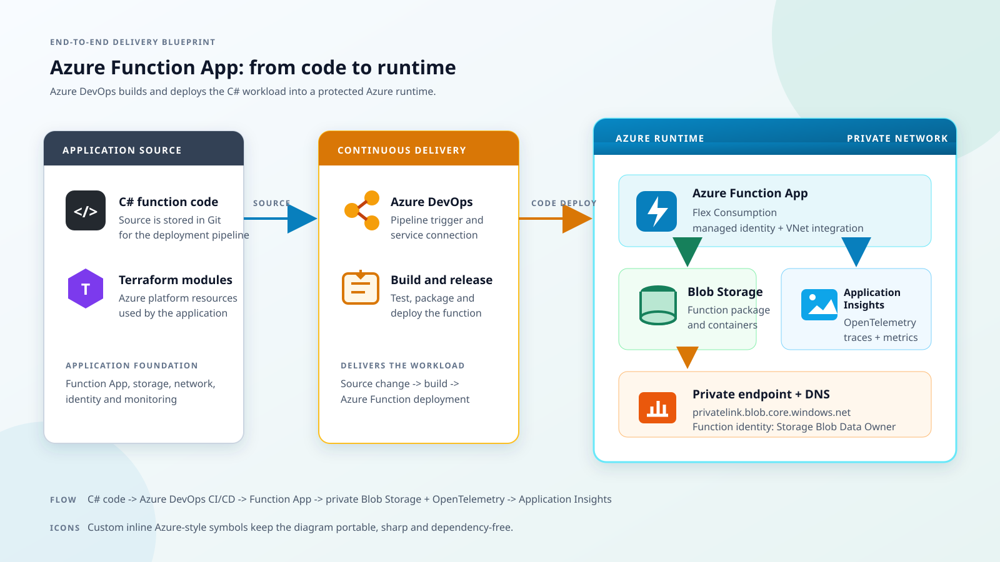
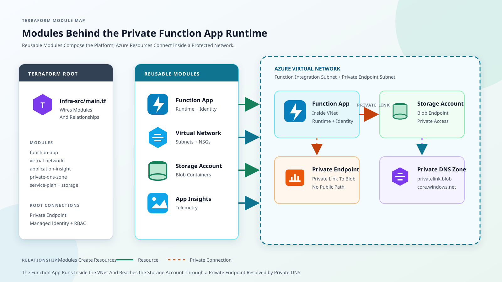

# Function App Infrastructure Project

## Architecture

## Terraform Modules And Azure Resources

Terraform modules define the Azure resource group, Function App, service plan, Blob Storage, Key Vault, virtual network, private endpoints, private DNS zones, Application Insights, and role assignments. 

Azure DevOps builds and deploys the C# function package to the Function App. At runtime, the Function App uses Blob Storage and Key Vault through private endpoints with managed identity access, then exports traces and metrics with OpenTelemetry to Application Insights.